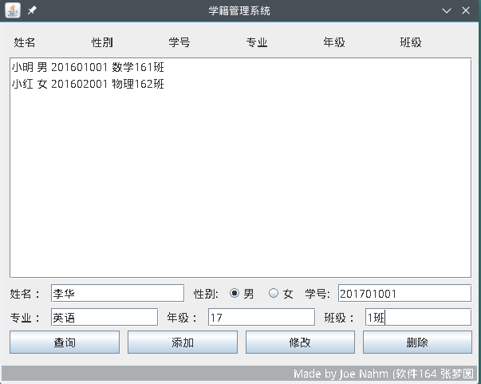

# 基于Java和MySQL的学生管理系统
这是java的最后一次上机报告,这个目录下放的是IDEA的项目文件

本系统提供了最简单的用以增删改查的图形界面，用起来体验还不错（我觉得）。



#### 亮点：
提供了模糊搜索功能

#### 注意：

1. 并未对输入做任何的**格式检查 **
2. 错误信息在命令行输出，并没有做弹窗（对，因为我懒）
3. 报以下错（并未处理）：
```
Exception in thread "AWT-EventQueue-0" java.lang.NullPointerException
	at javax.swing.plaf.basic.BasicScrollBarUI.layoutVScrollbar(BasicScrollBarUI.java:662)
	at javax.swing.plaf.basic.BasicScrollBarUI.layoutContainer(BasicScrollBarUI.java:866)
	at java.awt.Container.layout(Container.java:1512)
	at java.awt.Container.doLayout(Container.java:1501)
	at java.awt.Container.validateTree(Container.java:1697)
	at java.awt.Container.validateTree(Container.java:1706)
	at java.awt.Container.validateTree(Container.java:1706)
	at java.awt.Container.validateTree(Container.java:1706)
	at java.awt.Container.validateTree(Container.java:1706)
	at java.awt.Container.validateTree(Container.java:1706)
	at java.awt.Container.validateTree(Container.java:1706)
	at java.awt.Container.validateTree(Container.java:1706)
	at java.awt.Container.validate(Container.java:1632)
	at javax.swing.RepaintManager$3.run(RepaintManager.java:711)
	at javax.swing.RepaintManager$3.run(RepaintManager.java:709)
	at java.security.AccessController.doPrivileged(Native Method)
	at java.security.ProtectionDomain$JavaSecurityAccessImpl.doIntersectionPrivilege(ProtectionDomain.java:80)
	at javax.swing.RepaintManager.validateInvalidComponents(RepaintManager.java:708)
	at javax.swing.RepaintManager$ProcessingRunnable.run(RepaintManager.java:1731)
	at java.awt.event.InvocationEvent.dispatch(InvocationEvent.java:311)
	at java.awt.EventQueue.dispatchEventImpl(EventQueue.java:758)
	at java.awt.EventQueue.access$500(EventQueue.java:97)
	at java.awt.EventQueue$3.run(EventQueue.java:709)
	at java.awt.EventQueue$3.run(EventQueue.java:703)
	at java.security.AccessController.doPrivileged(Native Method)
	at java.security.ProtectionDomain$JavaSecurityAccessImpl.doIntersectionPrivilege(ProtectionDomain.java:80)
	at java.awt.EventQueue.dispatchEvent(EventQueue.java:728)
	at java.awt.EventDispatchThread.pumpOneEventForFilters(EventDispatchThread.java:205)
	at java.awt.EventDispatchThread.pumpEventsForFilter(EventDispatchThread.java:116)
	at java.awt.EventDispatchThread.pumpEventsForHierarchy(EventDispatchThread.java:105)
	at java.awt.EventDispatchThread.pumpEvents(EventDispatchThread.java:101)
	at java.awt.EventDispatchThread.pumpEvents(EventDispatchThread.java:93)
	at java.awt.EventDispatchThread.run(EventDispatchThread.java:82)
```